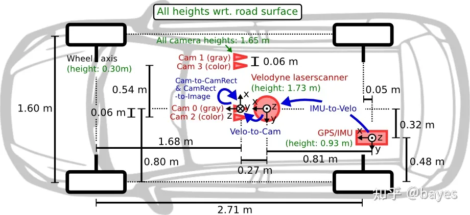

# hao_datasets
自己用的SLAM数据集整理，KITTI TUM EUROC ROSBAG
## 01 KITTI


### 1. odometry和raw的对应关系
Odometry页面的数据集目的是测试包括LiDAR和相机的纯SLAM（指无GPS）的结果，和raw数据集的对应关系如下。最后两列是指raw和odometry对应的起止序号，因为有几张是多余的。2011_09_26_drive_0067数据集不存在，应该是后期官方删除的。另外，odometry的00-10是有真值的，剩下的11-21是测试集。

> 00: 2011_10_03_drive_0027 000000 004540 \
01: 2011_10_03_drive_0042 000000 001100\
02: 2011_10_03_drive_0034 000000 004660\
03: 2011_09_26_drive_0067 000000 000800\
04: 2011_09_30_drive_0016 000000 000270\
05: 2011_09_30_drive_0018 000000 002760\
06: 2011_09_30_drive_0020 000000 001100\
07: 2011_09_30_drive_0027 000000 001100\
08: 2011_09_30_drive_0028 001100 005170\
09: 2011_09_30_drive_0033 000000 001590\
10: 2011_09_30_drive_0034 000000 001200

前面说了，odometry是纯SLAM但是如果你想验证GPS融合效果怎么办，这时候就不能只用odometry页面的数据了，根据上面的对应关系去把raw数据下载下来。这里有两个选择unsynced+unrectified、synced+rectified，前者指图像、LiDAR、GPS/IMU等数据没有对齐，图像也没有矫正，真正的原始数据，这块IMU的频率是100HZ；后者各源数据都是一一对齐的，图像也矫正了，但是GPS/IMU的频率只有10HZ，基本够用。

这里需要注意的是raw数据的oxtc并不是GPS真值，真值只有odometry的00-10有，要比来这比。做evo对比的时候，但是你又会发现00-10的真值时间戳不对，所以要从raw里面复制，然后用develop kit里面的代码合并一下就行了。

### 2. 标定文件



这里只记录raw数据的标定文件。不同日期采集的数据标定略有不同，包括三个文件：calib_cam_to_cam.txt，calib_imu_to_velo.txt，calib_velo_to_cam.txt，这个很简单，看上面图的坐标示意以及标定文件名字就懂了。其中，calib_cam_to_cam.txt需要好好说一说，另外两个有手就会。
> S_00:  未矫正的原图尺寸 \
K_00:  矫正前相机内参，因为矫正会做裁剪，甚至宽高比都会变，因此内参也会变\
D_00:  畸变系数 至于是不是K1 K2 K3 P1 P2的顺序俺就不清楚了，知道的可以留言告诉一声\
R_00:  从00号相机到i号相机的旋转矩阵，因为是00相机为起始坐标系，所以为单位阵\
T_00:  同上，平移矩阵\
S_rect_00: 裁剪后尺寸\
R_rect_00: 这个不大清楚，反正在转换到00的相机坐标系下之后，要被这个再左乘一下（程序里会自动扩充为4*4的矩阵）\
P_rect_00: 矫正后的内参矩阵；P_rect_01/02/03，这个参数是00的相机坐标系的点到投影到他们图像上的投影矩阵\

总之就是记住，凡事都是先转到00相机坐标系下，再左乘R_rect_00，之后：（1）用P_rect_0*参数转到对应相机的图像【2D】 （2）用[R_0* | T_0* ]转到对应相机的坐标系【3D】
## 02 tum

https://vision.in.tum.de/data/datasets/rgbd-dataset/download


### 2.1 TUM RGBD数据集工具及使用

#### 1. 工具

工具下载地址：https://vision.in.tum.de/data/datasets/rgbd-dataset/tools
• `add_pointclouds_to_bagfile.py` 给bag中加入点云topic
• `associate.py` 生成depth 和 rgb的匹配信息
• `evaluate_ate.py` 绝对误差评估，常用
• `evaluate_rpe.py` 相对误差评估
• `generate_pointcloud.py` 生成点云数据
• `generate_registered_pointcloud.py`
• `plot_camera_trajectories.m` matlab打印轨迹
• `plot_trajectory_into_image.py`
• `prepare3dedges.py`
• `project_point_cloud_to_image.py`

#### 2. 数据集

下载地址：https://vision.in.tum.de/data/datasets/rgbd-dataset/download
数据集包含`bag`及`tgz`两种格式
1）bag包：图像以15hz的频率发布，imu以500hz频率发布，较多卡顿现象，发布信息：

> /camera/depth/camera_info
> /camera/depth/image
> /camera/rgb/camera_info
> /camera/rgb/image_color
> /clock
> /cortex_marker_array
> /imu
> /rosout
> /rosout_agg
> /tf

使用方法：`rosbag play <bag_name>.bag`

2）tgz包：包含rgb及depth文件夹分别存放rgb图像及深度图，`accelerometer.txt`存放加速度信息，相对提供的bag包数据流畅。

使用方法：
1、解析文件夹，例程如：ORB_SLAM3/Examples/RGB-D/rgbd_tum.cc
2、使用如下脚本将tgz包解析转化为bag包，此时生成的bag包比官网提供的bag流畅，频率为30hz。

`generate_bags.py`：
s

```python
import cv2 
import time, sys, os
from ros import rosbag
import roslib
import rospy
roslib.load_manifest('sensor_msgs')
from sensor_msgs.msg import Image,Imu
from geometry_msgs.msg import Vector3
from cv_bridge import CvBridge
from numpy import asarray

# import ImageFile
from PIL import ImageFile
from PIL import Image as ImagePIL

def CompSortFileNamesNr(f):
    g = os.path.splitext(os.path.split(f)[1])[0] #get the file of the
    numbertext = ''.join(c for c in g if c.isdigit())
    return int(numbertext)

def ReadIMU(IMUFile):
    '''return IMU data and timestamp of IMU'''
    IMUfp = open(IMUFile,'r')
    IMULines = IMUfp.readlines()
    #all = IMUDatas.readlines()
    IMUDatas = {}
    for l in IMULines:
        if l[0] == "#":
            continue;
        items = l.rstrip('\n').split(' ')
        IMUDatas[items[0]] = items[1:]
    
    IMUfp.close()
    return IMUDatas 

def ReadImages(assocoations):
   assofp = open(assocoations, 'r')
   asso = assofp.readlines()
   RGBImages = {}
   depthImages = {}
   for l in asso:
       if l[0] == "#":
           continue;
       items = l.rstrip('\n').split(' ')
       RGBImages[items[0]] = items[1]
       depthImages[items[2]] = items[3]

   assofp.close()
   return RGBImages, depthImages

def CreateBag(args):#assocoations, imu, output_bag_name
    '''read assocoations.txt'''
    RGBImages,depthImages = ReadImages(args[1])

    IMUDatas = ReadIMU(args[2]) #the url of IMU data

    '''Creates a bag file with camera images'''
    if not os.path.exists(args[3]):
       os.system(r'touch %s' % args[3])
    else:
       os.system(r'rm %s' % args[3])
       os.system(r'touch %s' % args[3])

    bagName = rosbag.Bag(args[3], 'w')

    try:
        for it, iData in IMUDatas.items():
            imu = Imu()
            imuStamp = rospy.rostime.Time.from_sec(float(it))
            #angular_v = Vector3()
            linear_a = Vector3()
            #angular_v.x = float(iData[0])
            #angular_v.y = float(iData[1])
            #angular_v.z = float(iData[2])
            linear_a.x = float(iData[0])
            linear_a.y = float(iData[1])
            linear_a.z = float(iData[2])
            imu.header.stamp = imuStamp
            #imu.angular_velocity = angular_v
            imu.linear_acceleration = linear_a

            bagName.write("/imu",imu,imuStamp)

        br = CvBridge()

        for imt, img in RGBImages.items():
            #img = args[2] + img; 
            print("Adding %s" % img)

            cv_image = cv2.imread(img)

            Stamp = rospy.rostime.Time.from_sec(float(imt))

            '''set image information '''
            Img = br.cv2_to_imgmsg(cv_image)
            Img.header.stamp = Stamp
            Img.header.frame_id = "camera"

            '''for mono8'''
            Img.encoding = "rgb8"
            bagName.write('/camera/rgb/image_color', Img, Stamp)

        for dt, dimg in depthImages.items():
            #dimg = args[2] + dimg; 
            print("Adding %s" % dimg)

            cv_image = cv2.imread(dimg, cv2.IMREAD_ANYDEPTH)

            '''set image information '''
            Stamp = rospy.rostime.Time.from_sec(float(dt))

            '''set image information '''
            dImg = br.cv2_to_imgmsg(cv_image)
            dImg.header.stamp = Stamp
            dImg.header.frame_id = "camera"

            #dImg.encoding = "32FC1"

            bagName.write('/camera/depth/image', dImg, Stamp)

    finally:
        bagName.close()

if __name__ == "__main__":
    print(sys.argv)

    if len(sys.argv) < 4:
        print("Usage:\n\t python generate_bags.py /path/assocoations.txt /path/accelerometer.txt output.bag")
        exit(1)

    CreateBag(sys.argv)

```

**使用方法**：
首先：使用官网提供的脚本`associate.py`生成`assocoations.txt`文件

```bash
python  rgbd_benchmark_tools/scripts/associate.py /path/rgb.txt /path/depth.txt > assocoations.txt
```

然后使用上述`generate_bags.py`生成bag包

```bash
python rgbd_benchmark_tools/scripts/generate_bags.py /path/assocoations.txt /path/accelerometer.txt output.bag
```

### 2.2 制作TUM数据集

将带真值的bag数据转为tum数据格式

https://blog.csdn.net/qq_27350133/article/details/128103921

#### 1 步骤

1. 需要获取真值（我这里使用度量科技的动捕设备NoKov；如果有Mocap，根据mocap系统指示获取Groundtruth，mocap为optitrack，使用vrpn_client_ros包获取groundtruth。具体参考[这里](https://tuw-cpsg.github.io/tutorials/optitrack-and-ros/)。）
2. 同时录制话题`/camera/color/image_raw`、`/camera/aligned_depth_to_color/image_raw`和`/vrpn_client_node/RigidBody1/pose`，分别为RGB数据、对齐到RGB相机后的深度图和mocap输出的真实pose。
3. 使用以下程序一键生成TUM数据格式，**前提是已经安装好ROS，注意修改代码中bag包名字、话题名和输出路径**。

```python
#!/bin/python
import roslib
import rosbag
import rospy
import cv2
import os
from sensor_msgs.msg import Image
from geometry_msgs.msg import Pose, Quaternion, Point
from cv_bridge import CvBridge
from cv_bridge import CvBridgeError


ros_bag = 'sence5.bag'  #bag包路径
save_path = 'sence5/'   #输出数据集的路径
rgb = save_path + 'rgb/'  #rgb path
depth = save_path + 'depth/'   #depth path

bridge = CvBridge()

file_handle1 = open(save_path + 'rgb.txt', 'w')
file_handle2 = open(save_path + 'depth.txt', 'w')
file_handle3 = open(save_path + 'groundtruth.txt', 'w')

with rosbag.Bag(ros_bag, 'r') as bag:
    for topic,msg,t in bag.read_messages():

        if topic == "/camera/color/image_raw":   #rgb topic
            cv_image = bridge.imgmsg_to_cv2(msg,"bgr8")
            timestr = "%.6f" %  msg.header.stamp.to_sec()   #rgb time stamp
            image_name = timestr+ ".png"
            path = "rgb/" + image_name
            file_handle1.write(timestr + " " + path + '\n')
            cv2.imwrite(rgb + image_name, cv_image)

        if topic == "/camera/aligned_depth_to_color/image_raw":  #depth topic
            cv_image = bridge.imgmsg_to_cv2(msg)
            #cv_image = bridge.imgmsg_to_cv2(msg, '32FC1')
            #cv_image = cv_image * 255
            timestr = "%.6f" %  msg.header.stamp.to_sec()   #depth time stamp
            image_name = timestr+ ".png"
            path = "depth/" + image_name
            file_handle2.write(timestr + " " + path + '\n')
            cv2.imwrite(depth + image_name, cv_image)

        if topic == '/vrpn_client_node/RigidBody_ZLT_UAV/pose': #groundtruth topic
            p = msg.pose.position
            q = msg.pose.orientation
            timestr = "%.6f" %  msg.header.stamp.to_sec()
            file_handle3.write(timestr + " " + str(round(p.x, 4)) + " " + str(round(p.y, 4)) + " " + str(round(p.z, 4)) + " ")
            file_handle3.write(str(round(q.x, 4)) + " " + str(round(q.y, 4)) + " " + str(round(q.z, 4)) + " " + str(round(q.w, 4)) + '\n')
file_handle1.close()
file_handle2.close()
file_handle3.close()

```

1. 值得注意的是，获取的真值pose和SLAM输出的pose不在同一个坐标系下，如果要使用自己制作的数据集并进行精度评估，则需要使用[evo评估工具](https://github.com/MichaelGrupp/evo)。

2. 使用时，由于真值pose帧率高，而d435输出RGB和depth被设定为30Hz，所以两者时间戳会不同步。在使用evo工具时，则需要指定相关参数，否则评估将会出错，如下所示：

   ```shell
   evo_ape tum Groundtruth.txt OurCameraTrajectory.txt -p -va --save_results results/Our.zip --t_max_diff=0.05 --t_offset=0.05
   ```

   这儿的`--t_max_diff=0.05 --t_offset=0.05`和`-a`分别表示允许的最大时间误差、时间偏移和对齐坐标系。


## 03 EuRoC


Euroc提供ROS和zip两种数据格式

下载地址：https://projects.asl.ethz.ch/datasets/doku.php?id=kmavvisualinertialdatasets#downloads


ROSBAG格式：


ZIP格式：

```shell
├── body.yaml						// 没啥用
├── cam0							// 左目图像数据
│   ├── data	 					// *.png文件（文件命名即为时间戳）
│   ├── data.csv					// 两列，第一列为时间戳，第二列为对应图片名
│   └── sensor.yaml					// 相机内外参数文件
├── cam1							// 右目图像数据
│   ├── data
│   ├── data.csv
│   └── sensor.yaml
├── imu0
│   ├── data.csv					// 7列，[时间戳，gyr_x,gyr_y,gyr_z, acc_x,acc_y,acc_z]
│   └── sensor.yaml					// imu标定数据
├── leica0							// Leica MS50 用于测量ground_truth
│   ├── data.csv					// 4列 时间戳+位姿
│   └── sensor.yaml					// 外参
└── state_groundtruth_estimate0
    ├── data.csv					// 17列 [时间戳，pose,四元数，vectory，b_w,b_a]
    └── sensor.yaml
```

读取Euroc图片数据代码

```cpp
/**
 * @brief 读取Euroc图片数据
 *  */
size_t load_image_data(const string &image_folder,
                       std::vector<string> &limg_name,
                       std::vector<string> &rimg_name) {
    LOG(INFO) << "Loading " << image_folder;
    std::string l_path = image_folder + "/mav0/cam0/data.csv";
    std::string r_path = image_folder + "/mav0/cam1/data.csv";
    std::string r_img_prefix = image_folder + "/mav0/cam1/data/";
    std::ifstream limg_file(l_path);
    std::ifstream rimg_file(r_path);
    if (!limg_file.is_open() || !rimg_file.is_open()) {
        LOG(WARNING) << image_folder << " cannot be opened";
        return 0;
    }
    std::string line;
    std::string time;
    while (getline(limg_file, line)) {
        if (line[0] == '#')
            continue;
        std::istringstream is(line);
        int i = 0;
        while (getline(is, time, ',')) {
            bool is_exist = boost::filesystem::exists(r_img_prefix + time + ".png");
            if (i == 0 && is_exist) {
                limg_name.push_back(time + ".png");
                rimg_name.push_back(time + ".png");
            }
            i++;
        }
    }
    limg_file.close();
    rimg_file.close();
    LOG(INFO) << "loaded " << limg_name.size() << " images";
    return limg_name.size();
}
```

读取图像时间戳的代码

```cpp
/**
 * @brief 计算 图像帧 与 offset_ns 之间的时间差
 * @param img_name Euroc 图像文件名
 * @param offset_ns 参考时间戳
 * */
float get_timestamp_from_img_name(const string &img_name,
                                  uint64_t offset_ns) {
    // 注：Euroc中，图片命名即为其时间戳
    string ts_ns_string = fs::path(img_name).stem().string();
    int64_t offset_t = boost::lexical_cast<uint64_t>(ts_ns_string) - offset_ns;
    int64_t t = offset_t / 1e5;     // 时间戳最后五位应当一致，或者说影响不大，认为是误差
    return static_cast<float>(t) / 1e4;
}
12345678910111213
```

读取Euroc imu数据代码

```cpp
/**
 * @brief 读取Euroc imu数据
 *  */
size_t load_imu_data(const string &imu_file_str,
                     std::list<XP::ImuData> *imu_samples_ptr,
                     uint64_t &offset_ts_ns) {
    CHECK(imu_samples_ptr != NULL);
    LOG(INFO) << "Loading " << imu_file_str;
    std::ifstream imu_file(imu_file_str.c_str());
    if (!imu_file.is_open()) {
        LOG(WARNING) << imu_file_str << " cannot be opened";
        return 0;
    }
    std::list<XP::ImuData> &imu_samples = *imu_samples_ptr;
    imu_samples.clear();
    // read imu data
    std::string line;
    std::string item;
    double c[6];
    uint64_t t;
    bool set_offset_time = false;
    while (getline(imu_file, line)) {
        if (line[0] == '#')
            continue;
        std::istringstream is(line);
        int i = 0;
        while (getline(is, item, ',')) {
            std::stringstream ss;
            ss << item;
            if (i == 0)
                ss >> t;
            else
                ss >> c[i - 1];
            i++;
        }
        if (!set_offset_time) {
            set_offset_time = true;
            offset_ts_ns = t;
        }
        XP::ImuData imu_sample;
        float _t_100us = (t - offset_ts_ns) / 1e5;
        imu_sample.time_stamp = _t_100us / 1e4;		// 以第一组IMU数据的时间戳为时间原点0，单位s
        imu_sample.ang_v(0) = c[0];
        imu_sample.ang_v(1) = c[1];
        imu_sample.ang_v(2) = c[2];
        imu_sample.accel(0) = c[3];
        imu_sample.accel(1) = c[4];
        imu_sample.accel(2) = c[5];

        VLOG(3) << "accel " << imu_sample.accel.transpose()
                << " gyro " << imu_sample.ang_v.transpose();
        imu_samples.push_back(imu_sample);
    }
    imu_file.close();
    LOG(INFO) << "loaded " << imu_samples.size() << " imu samples";
    return imu_samples.size();
}
```

## 04 lidar_SLAM


## 05 ROSBAG

**1.rosbag  录制使用**

```cpp
rosbag record -a  录制所有话题
rosbag record /topic_name    录制指定话题
rosbag record -O filename.bag /topic_name  指定生成数据包的名字filename.bag
rosbag record -b 4092 /topic_name   扩大录制内存限制
Record a bag file with the contents of specified topics.
```

1.2 如果在 launch 文件中使用 rosbag record 命令，如下：

```xml
<node pkg="rosbag" type="record" name="bag_record" args="/topic1 /topic2"/> 
```

 **2.rosbag info** 

2.1 rosbag info指令可以显示数据包中的信息:

```cpp
rosbag info filename.bag
```

2.2 输出yaml配置参数 Print information in YAML format.

```undefined
 rosbag info -y filename.bag
```

**3.rosbag 回放使用**

rosbag info name.bag 查看话题名称、类型、消息数量

rosbag play name.bag 回放数据包

rosbag play -r 1.5 name.bag 1.5倍速回放，按一定频率回放，-r选项用来设定消息发布速率；

rosbag play -l name.bag 按一定频率回放，-l选项用来设定循环播放；

rosbag play name.bag --topic /topic1 只播放感兴趣的topic;

-d 用来指定延迟播放的时间（sec）;

​    -s参数用来指定从几秒开始；rosbag play -s 10 xx.bag

​    -u 参数表示仅播放包的前几秒信息；rosbag play -u 10 xx.bag

​    -r 参数用来指定播放速度

​    -l 循环播放

​       在上述播放命令执行期间，空格键可以暂停播放。

如果想修改topic名字播放

```cpp
rosbag play file.bag /topic_name:=/reame_topic_name    
#//topic_name是原topic，reame_topic_name是新topic
```

**4.rosbag操作**

4.1 将file_name.bag文件中/odom话题的消息转换到odom_name.txt文件中

```cpp
rostopic echo -b file_name.bag -p /odom > odom_name.txt
```

4.2 rosbag文件提取话题数据，生成temp1.bag只保留/odom，/tf数据

```cpp
rosbag filter temp.bag temp1.bag "topic=='/odom' or topic=='/tf'"
```

4.3 过滤，保留某个时间段的数据

```cpp
rosbag filter my.bag out.bag "t.to_sec() >= 123564.77 and t.to_sec() <= 794545.88"
```

4.4 如果播放两个及以上bag包，那么他们会第一帧对其，后面根据第一帧时间戳的时间差播放。

```cpp
rosbag play recorded1.bag recorded2.bag
```

4.5 启动5秒进入包中。

```undefined
rosbag play -s 5 recorded1.bag
```

4.6 启动时暂停按空格键开始回放

```scss
rosbag play --pause record.bag
```
