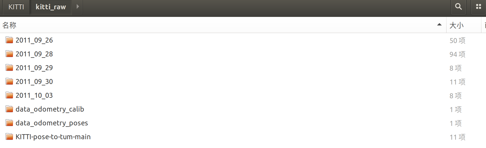
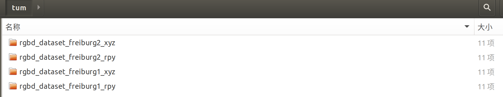
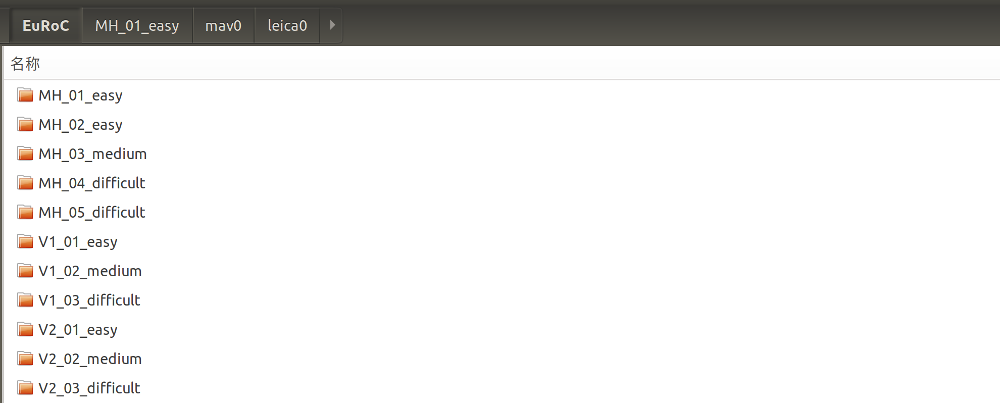
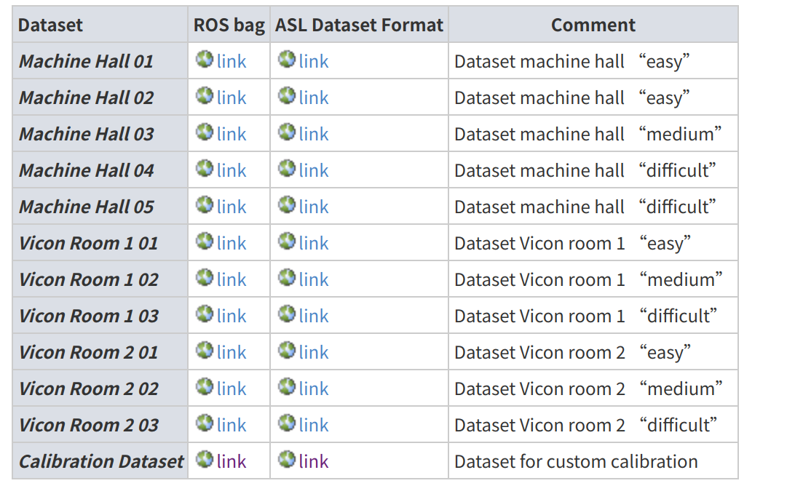
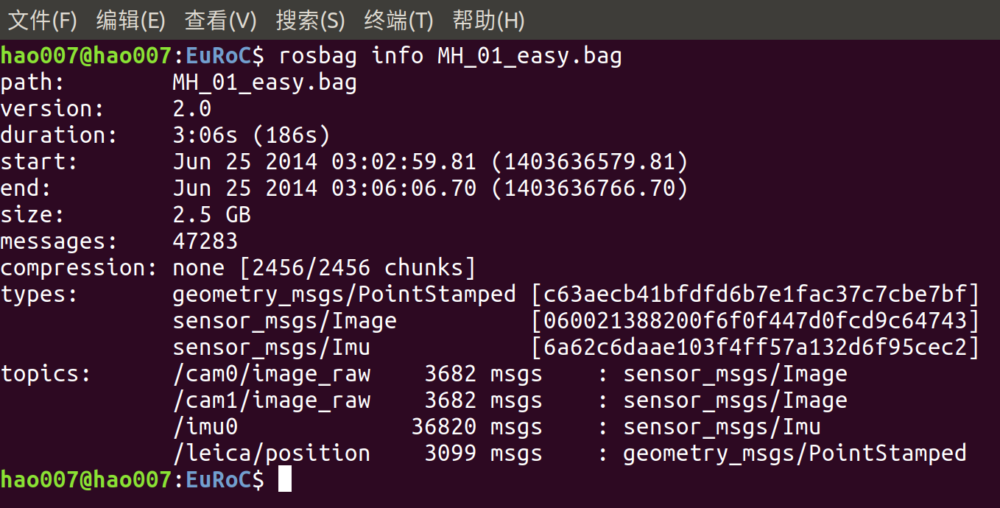
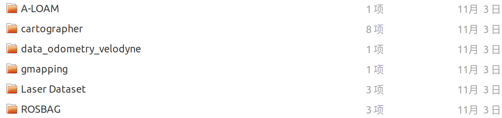

<!--
 * @Author: zhanghao
 * @Date: 2022-11-29 14:47:13
 * @LastEditTime: 2022-11-29 15:00:09
 * @FilePath: /hao_datasets/README.md
 * @Description: 
-->
# hao_datasets
自己用的SLAM数据集整理，KITTI TUM EUROC ROSBAG
## 01 KITTI



## 02 tum

https://vision.in.tum.de/data/datasets/rgbd-dataset/download



## 03 EuRoC



Euroc提供ROS和zip两种数据格式

下载地址：https://projects.asl.ethz.ch/datasets/doku.php?id=kmavvisualinertialdatasets#downloads



ROSBAG格式：



ZIP格式：

```shell
├── body.yaml						// 没啥用
├── cam0							// 左目图像数据
│   ├── data	 					// *.png文件（文件命名即为时间戳）
│   ├── data.csv					// 两列，第一列为时间戳，第二列为对应图片名
│   └── sensor.yaml					// 相机内外参数文件
├── cam1							// 右目图像数据
│   ├── data
│   ├── data.csv
│   └── sensor.yaml
├── imu0
│   ├── data.csv					// 7列，[时间戳，gyr_x,gyr_y,gyr_z, acc_x,acc_y,acc_z]
│   └── sensor.yaml					// imu标定数据
├── leica0							// Leica MS50 用于测量ground_truth
│   ├── data.csv					// 4列 时间戳+位姿
│   └── sensor.yaml					// 外参
└── state_groundtruth_estimate0
    ├── data.csv					// 17列 [时间戳，pose,四元数，vectory，b_w,b_a]
    └── sensor.yaml
```

读取Euroc图片数据代码

```cpp
/**
 * @brief 读取Euroc图片数据
 *  */
size_t load_image_data(const string &image_folder,
                       std::vector<string> &limg_name,
                       std::vector<string> &rimg_name) {
    LOG(INFO) << "Loading " << image_folder;
    std::string l_path = image_folder + "/mav0/cam0/data.csv";
    std::string r_path = image_folder + "/mav0/cam1/data.csv";
    std::string r_img_prefix = image_folder + "/mav0/cam1/data/";
    std::ifstream limg_file(l_path);
    std::ifstream rimg_file(r_path);
    if (!limg_file.is_open() || !rimg_file.is_open()) {
        LOG(WARNING) << image_folder << " cannot be opened";
        return 0;
    }
    std::string line;
    std::string time;
    while (getline(limg_file, line)) {
        if (line[0] == '#')
            continue;
        std::istringstream is(line);
        int i = 0;
        while (getline(is, time, ',')) {
            bool is_exist = boost::filesystem::exists(r_img_prefix + time + ".png");
            if (i == 0 && is_exist) {
                limg_name.push_back(time + ".png");
                rimg_name.push_back(time + ".png");
            }
            i++;
        }
    }
    limg_file.close();
    rimg_file.close();
    LOG(INFO) << "loaded " << limg_name.size() << " images";
    return limg_name.size();
}
12345678910111213141516171819202122232425262728293031323334353637
```

读取图像时间戳的代码

```cpp
/**
 * @brief 计算 图像帧 与 offset_ns 之间的时间差
 * @param img_name Euroc 图像文件名
 * @param offset_ns 参考时间戳
 * */
float get_timestamp_from_img_name(const string &img_name,
                                  uint64_t offset_ns) {
    // 注：Euroc中，图片命名即为其时间戳
    string ts_ns_string = fs::path(img_name).stem().string();
    int64_t offset_t = boost::lexical_cast<uint64_t>(ts_ns_string) - offset_ns;
    int64_t t = offset_t / 1e5;     // 时间戳最后五位应当一致，或者说影响不大，认为是误差
    return static_cast<float>(t) / 1e4;
}
12345678910111213
```

读取Euroc imu数据代码

```cpp
/**
 * @brief 读取Euroc imu数据
 *  */
size_t load_imu_data(const string &imu_file_str,
                     std::list<XP::ImuData> *imu_samples_ptr,
                     uint64_t &offset_ts_ns) {
    CHECK(imu_samples_ptr != NULL);
    LOG(INFO) << "Loading " << imu_file_str;
    std::ifstream imu_file(imu_file_str.c_str());
    if (!imu_file.is_open()) {
        LOG(WARNING) << imu_file_str << " cannot be opened";
        return 0;
    }
    std::list<XP::ImuData> &imu_samples = *imu_samples_ptr;
    imu_samples.clear();
    // read imu data
    std::string line;
    std::string item;
    double c[6];
    uint64_t t;
    bool set_offset_time = false;
    while (getline(imu_file, line)) {
        if (line[0] == '#')
            continue;
        std::istringstream is(line);
        int i = 0;
        while (getline(is, item, ',')) {
            std::stringstream ss;
            ss << item;
            if (i == 0)
                ss >> t;
            else
                ss >> c[i - 1];
            i++;
        }
        if (!set_offset_time) {
            set_offset_time = true;
            offset_ts_ns = t;
        }
        XP::ImuData imu_sample;
        float _t_100us = (t - offset_ts_ns) / 1e5;
        imu_sample.time_stamp = _t_100us / 1e4;		// 以第一组IMU数据的时间戳为时间原点0，单位s
        imu_sample.ang_v(0) = c[0];
        imu_sample.ang_v(1) = c[1];
        imu_sample.ang_v(2) = c[2];
        imu_sample.accel(0) = c[3];
        imu_sample.accel(1) = c[4];
        imu_sample.accel(2) = c[5];

        VLOG(3) << "accel " << imu_sample.accel.transpose()
                << " gyro " << imu_sample.ang_v.transpose();
        imu_samples.push_back(imu_sample);
    }
    imu_file.close();
    LOG(INFO) << "loaded " << imu_samples.size() << " imu samples";
    return imu_samples.size();
}
```

## 04 lidar_SLAM


