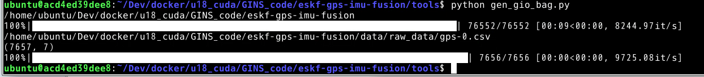

# 01 对于bag包的处理

- **过滤单个topic**

```
rosbag filter input.bag only-tf.bag "topic == '/tf'"
```

- **过滤多个topic**

```
rosbag filter input.bag output.bag "topic == '/velodyne_point_cloud' or topic =='/visensor/imu' or topic == '/visensor/left/image_raw'"
```


- **从bag包中截取相应的数据**

  ```
  rosbag filter xxx.bag  xxxafter.bag "(topic =='/lslidar_packet' or topic =='/imu/data' or topic =='/nmea_sentence') "
  ```

- **从一个bag 包中截取某段时间内的数据**

  ```
  rosbag 2021-01-23-16-51-27_besidepicture.bag 2021-01-23-16-51-27_5min.bag" “ t.to_sec() <= 1611392188.19"
  ```

- **从bag包中截取相应的话题以及相应的时间段**

```
rosbag filter g00_kitti_2011_10_03_drive_0027_synced.bag 00g.bag "(topic == '/kitti/camera_color_left/image_raw' or topic == '/kitti/camera_color_left/image_raw') and (t.to_sec()>=1317617780 and t.to_sec()<=1317618000)"
```

## rosbag提取图片convert.py

```python
import roslib
import rosbag
import rospy
import cv2
import os
from sensor_msgs.msg import Image
from cv_bridge import CvBridge
from cv_bridge import CvBridgeError

rgb = '/home/sydemo/bag2tum/results/rgb/'  #rgb path
depth = '/home/sydemo/bag2tum/results/depth/'   #depth path
bridge = CvBridge()

file_handle1 = open('/home/sydemo/bag2tum/results/depth.txt', 'w')
file_handle2 = open('/home/sydemo/bag2tum/results/rgb.txt', 'w')

with rosbag.Bag('/home/sydemo/test.bag', 'r') as bag:
    for topic,msg,t in bag.read_messages():
        if topic == "/device_0/sensor_0/Depth_0/image/data":  #depth topic
            cv_image = bridge.imgmsg_to_cv2(msg)
            timestr = "%.6f" %  msg.header.stamp.to_sec()   #depth time stamp
            image_name = timestr+ ".png"
            path = "depth/" + image_name
            file_handle1.write(timestr + " " + path + '\n')
            cv2.imwrite(depth + image_name, cv_image)
        if topic == "/device_0/sensor_1/Color_0/image/data":   #rgb topic
            cv_image = bridge.imgmsg_to_cv2(msg,"bgr8")
            timestr = "%.6f" %  msg.header.stamp.to_sec()   #rgb time stamp
            image_name = timestr+ ".jpg"
            path = "rgb/" + image_name
            file_handle2.write(timestr + " " + path + '\n')
            cv2.imwrite(rgb + image_name, cv_image)
file_handle1.close()
file_handle2.close()

```

## BAG2TUM
Kinect + ROS TUM数据制作

https://blog.csdn.net/Destiny_zc/article/details/123285089

## 手机视频制作TUM格式数据集

手机视频制作TUM格式数据集(ORB-SLAM2测试) https://www.guyuehome.com/36146

TUM数据集格式介绍: https://www.guyuehome.com/35828
rosbag数据集转TUM格式: https://www.guyuehome.com/35920
ROS下使用电脑相机运行ORB-SLAM2: https://blog.csdn.net/qinqinxiansheng/article/details/107079265
opencv调用相机运行ORB-SLAM2: https://blog.csdn.net/zhangqian_shai/article/details/88406981
https://blog.csdn.net/s534435877/article/details/107655020

## bag2gnssandimudata
