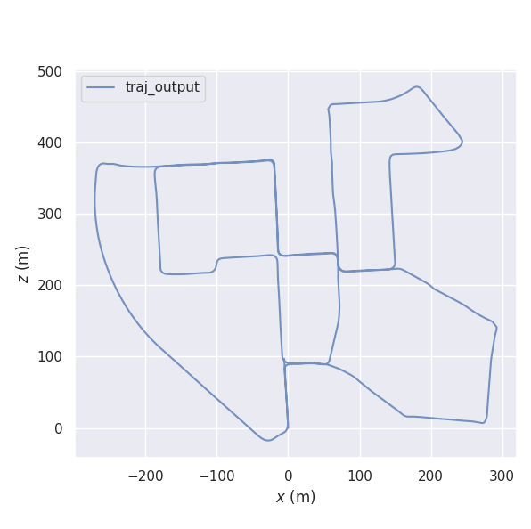

<!--
 * @Author: https://github.com/haohaoalt
 * @Date: 2023-12-06 12:08:36
 * @LastEditors: hayden haohaoalt@163.com
 * @LastEditTime: 2023-12-06 12:10:00
 * @FilePath: /hao_datasets/kitti/kitti.md
 * @Description: 
 * Copyright (c) 2023 by haohaoalt@163.com, All Rights Reserved. 
-->

## KITTI2TUM

```
python kitti_poses_and_timestamps_to_trajectory.py 00.txt times.txt traj_output.txt
evo_traj tum traj_output.txt -p --plot_mode=xz
```
